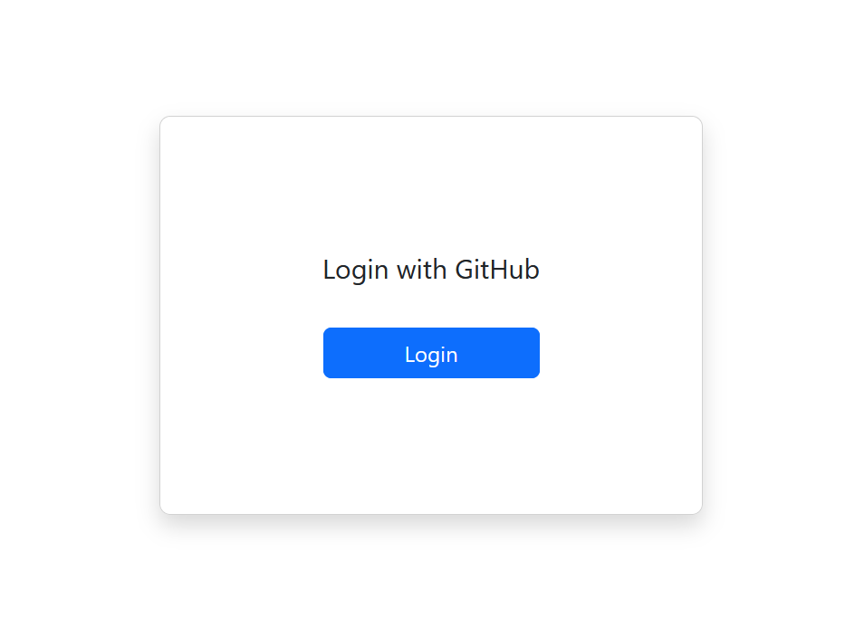
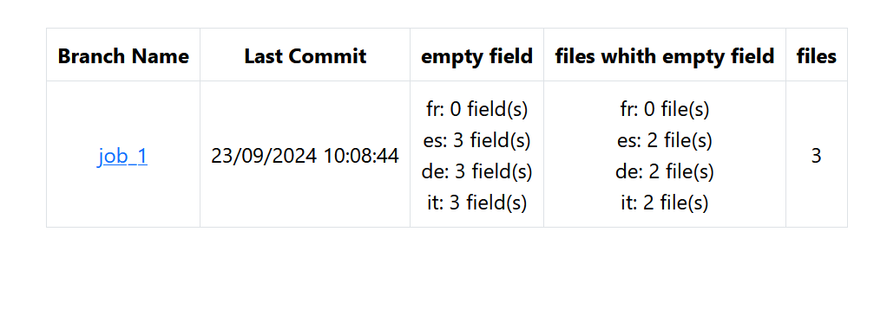
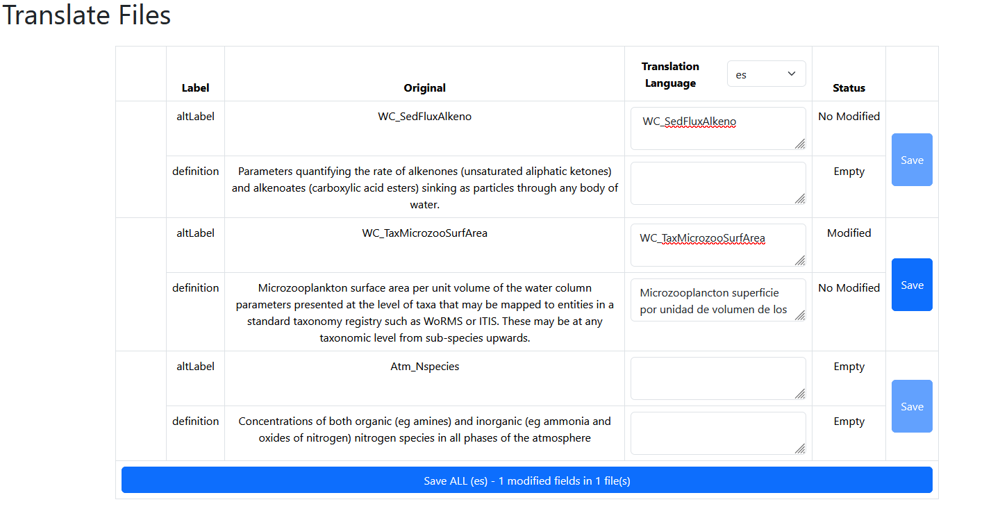
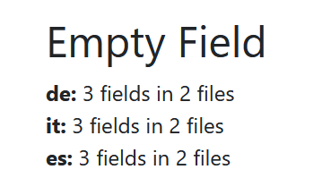
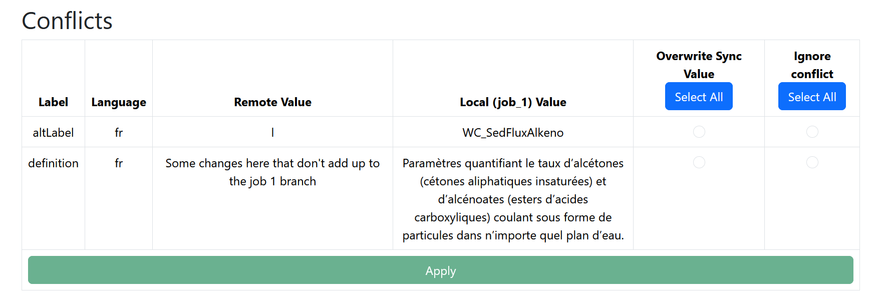
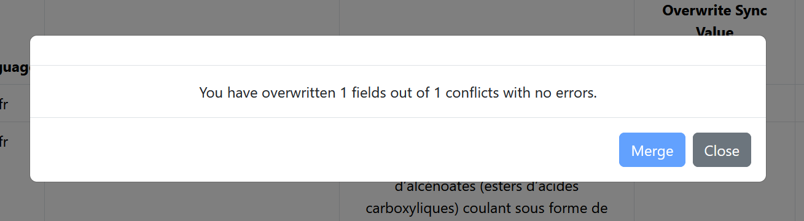

# How to Use the Translation Website

## Information Page (User):
### Login Page:

- Log in with your GitHub account to perform translation actions.

### Branch Page:

- You can select a file grouping to translate by clicking on the branch name.
- You can view the last modification date for each branch.
- You can see the number of empty fields per language for each branch.
- You can see the number of files with empty fields per language for each branch.
- You can view the total number of files for each branch.

### Navbar:

- By clicking on `Marine_Translate_Term`, you will be redirected to the main site.
- If a branch is selected:
  - You will see the currently selected branch.
  - You can return to the branch selection page by clicking on `Branches`.
  - You can go to the translation page by clicking on `Translate`.
  - You can go to the change verification page by clicking on `Changed`.

## Translate Page:

- You can select the translation language from the options provided by the repository.
- You can view translations with their original label and term for the selected language.
- You can propose a new translation or modify an existing one.
- You can submit your translation proposals per file by clicking on "Save" or submit all proposals at once with "Save All".

## Changed Page:

- You can see the number of empty fields per language and the number of files containing them.

- You can view conflicting fields with their label, language, and values.
- You can choose between the "Remote value" or "Ignore conflict" (keep the branch value).
- If all conflict choices have been made:
  - You can apply the selection.

  - Once applied, if no empty fields remain:
    - You can merge the branch with the main branch (note: this will delete the branch). If the merge fails, retry a second time.
